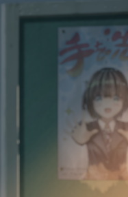

# 月の彼方で会いましょう

## 灯華 route

The protagonist's name is <ruby>奏汰<rt>かなた</rt></ruby> which has similar sound as the game title (<ruby>彼方<rt>かなた</rt></ruby>).

The game starts with the main character as a adult. He recalls about his high school past. He also has some flashback about <ruby>灯華<rt>とうか</rt></ruby>'s speech and about she was pointing a pink gun at her hear. She was asking <ruby>奏汰<rt>かなた</rt></ruby> if she comes to the other side of the moon, would he chase after her.

After the flashback, we arrive at <ruby>奏汰<rt>かなた</rt></ruby>'s high school time.

We had 2 choices before leaving our focus with 灯華. Probably rasing flag here.

---

The first heroine we will interact is <ruby>灯華<rt>とうか</rt></ruby>. She seems always come late to class and sleep in the class all the time.

One time, she was being chased by a teacher. She came to <ruby>奏汰<rt>かなた</rt></ruby>'s club room and asked him to hide her. Her speech during this encounter is very energetic. She gave me the impression of ギャル (gal) - a very beautiful person instead of a bitchy one. She read <ruby>奏汰<rt>かなた</rt></ruby>'s novel (note) which he hopelessly tried to get it back.

---

It seems that 奏汰 works for a cafe (<ruby>店<rt>みせ</rt></ruby>).The cafe seems to be operated by <ruby>聖衣良<rt>せいら</rt></ruby>'s family. She is quite childish (子供っぽい). Is she a middle schooler? She seems to be quite talent at drawing. Her <ruby>声優<rt>せいゆう</rt></ruby>'s voice is quite childish. She seems to be a <ruby>占<rt>うらな</rt>い</ruby> type of person.

After work, we had two choices:

- 俺のことを占ってもらう
- 別の人を占ってもらう

I probably skip <ruby>聖衣良<rt>せいら</rt></ruby> with second option. Now we have 3 more choices:

- <ruby>新谷<rt>あらや</rt>灯華<rt>とうか</rt></ruby>
- <ruby>日紫喜<rt>ひしき</rt>うぐいす</ruby>
- <ruby>佐倉<rt>さくら</rt>雨音<rt>れいん</rt></ruby>

Let's choose our main heroine 灯華.

聖依良 asks 奏汰 about 将来. He answers he had 部活動 and バイト so he didn't think much about it. <ruby>聖依良<rt>せいら</rt></ruby> wants to be a fashion designer.

> お兄ちゃんのお嫁さん

<ruby>聖依良<rt>せいら</rt></ruby> seems to be <ruby>奏汰<rt>かなた</rt></ruby>'s cousin. Her family does not operate the <ruby>店<rt>みせ</rt></ruby>.

> 彼女が欲しい！

---

<ruby>奏汰<rt>かなた</rt></ruby> met <ruby>雨音<rt>れいん</rt></ruby> on his moon stroll several days later.

> <ruby>満月<rt>まんげつ</rt>の<rt></rt>日<rt>ひ</rt>に、お<rt></rt>月<rt>つき</rt>さまがいっぱい<rt></rt>涙<rt>なみだ</rt>を<rt></rt>流<rt>なが</rt>して、<rt></rt>泣<rt>な</rt>きやんだあとに

It started to rain.

She got wet. And we can see her <ruby>下着<rt>したぎ</rt></ruby>. With a cute reaction. We have to choose:

- <ruby>なにか<rt></rt>拭<rt>ふ</rt>くものを</ruby>
- <ruby>佐倉<rt>さくら</rt>の<rt></rt>肌<rt>はだ</rt>って</ruby>

Let's be a gentleman here. I went with the first choice.

> おまえは...誰だ

I can't hold my laugh. 🤣

> タナカ 🤣

> 子猫みたいな

---

> <ruby>勝手<rt>かって</rt>に<rt></rt>人<rt>ひと</rt>の<rt></rt>心<rt>こころ</rt>の<rt></rt>声<rt>こえ</rt>アテレコしないでくれるかな</ruby> 🤣

---

> 灯華とデートしたい！

> 好きビーム

灯華 wants to use LED at 灯台 (lighthouse) to celebrate うぐいす先輩. Moose code is kinda classic, isn't it? Yeah, most of us know about Moose code but don't actually know Moouse code itself at all. Let's see what else do we have here:

- <ruby>モールス<rt></rt>信号<rt>しんごう</rt>を<rt></rt>調<rt>しら</rt>べる</ruby>
- <ruby>光<rt>ひかり</rt>で<rt></rt>文字<rt>もじ</rt>を<rt></rt>書<rt>か</rt>いてむる</ruby>

I think research about Moose code is kinda pathetic. I will go with second choice.

No, the second choice is boring.

灯華 is quite excited about Moose code.

奏汰 spent the night with 灯華 inside 灯台.

She is めちゃくちゃ眠い in the next morning.

They sent "Happy Birthday" in Moose code.

---

うぐいす先輩 seems to know Moouse code. Flag time:

- 灯華と一緒にやったと白状する
- うぐいす先輩にはパレたくない

I wonder if 灯華 is happy about we tell うぐいす先輩 about last night. Let's try.

先輩 seems not happy about it. Let's try the other choice.

Let's continue with our first choice.

---

We are also being interogated by 妹さん - 聖衣良.

- 夜遊びしていたと認める
- 聖衣良の教育上、否定する

Let's be an adult an admit that.

Adult is pretty unfair with children.

---

Our next encounter with 雨音 at the cafe in another rainy day.

- タオルをとりにいく
- これくらいすぐに乾くはず

---

I decide to force 奏汰 to complete the novel.

灯華 is kinda a push-over one.

I think we get into 灯華 route. She came over. Now, she is taking お風呂. She is also going to use 奏汰's パンツ.

I think we have Summer Pockets cross-over. 猫と冒険

灯華 seems not like to read a lot of 漢字.

We are going to have a date with 灯華 to buy smartphone.

---

灯華 is going to transfer.

---

We missed 灯華の誕生日 (22日2月). She still has cake.

---

振られた。灯華で。

---

In the After part, we met with several heroines that didn't appear in the School Arc.

灯華 dissapeared behind the train. And we have 8 years time skip.

奏汰 found 灯華's smartphone. He uses this phone to send LIME message to himself.

He asked his past self to write something in the "猫の..." book. 灯華 wrote something.

> 私はここにいる
> ニャーニャーニャー

奏汰 still keeps in touch with うぐいす先輩.

> 猫っぽい子

---

It seems that there are suspicious photos in 灯華's smartphone. There is not any visual photo for us to look at. 奏汰 asked 佐倉雨音 to "decrypt" them. She suggested that he should not look into the data but still handed over for him anyway.

---

It seems that our trip with 灯華 to 京都 is going to be changed. We will find out where she was going alone. She had some killer photo in her smartphone.

Love hotel だ

してないかった

---

While high school 奏汰 is filrting with 灯華, adult 奏汰 will have a date with 岬栞菜.

---

I have finished 灯華 route.

灯華 wanted to kill her biological father "Kazama" だってか? We didn't know that person she wants to kill is her father. I thought that he kills her mother or made her mother commits suicide. Well, the truth is not far from that. But now we know that the person 灯華 wants to kill is her father.

In the highschool "timeline", 奏汰 and 灯華 do it nearly every occasion (even outside).

I put "timeline" in quote because there is a reason. Let's put it off here and tell more about it later.

Oh. I didn't mention before that 岬栞菜 (漫画家さん) made a 漫画 based on the story 奏汰 told her about his 初恋 with 灯華.

In highschool "timeline", 奏汰 and 灯華 kidnapped 灯華's father (with gun and car).

岬栞菜 tried to hit on 奏汰. Sorry, I realised that we already on 灯華 route so we cannot branch off here.

After the ending and conversation with 灯華, I think that 灯華 was the one who send message to 奏汰. There is no sending message through time here. 灯華 wanted to see if 奏汰 will love no matter she had an unfortunated life and may not bring him happiness. And the story about highschool "timeline" is created by 奏汰 and featured in the 漫画 as 奏汰 answer to 灯華.

Maybe 灯華 took an photo of 奏汰 in secret back in the days he was still working at the cafe. She may even intrude his apartment to put her writing in the "猫の..." book. And 奏汰, as a novelist, made a story from his experience.

One thing is still not clear for me about the flashback at the beginning when 灯華 points the gun at her head. I think may be 奏汰 did experience that flashback but the story about 奏汰 highschool before 8 years timeskip is from the 漫画. Maybe the real timeline is a mix of the highschool "timeline" and the "timeline" that we go through in 奏汰 highschool. However, the highschool "timeline" ending is created by 奏汰 as his resolution to 灯華.

# Second playthrough

In the start, I pay attention to the background music and we have some heart-beat like sound. It makes me remember about 灯華 near dying moment in the last route.

> <ruby>月<rt>つき</rt>が<rt></rt>冷<rt>つめ</rt>たく<rt></rt>冴<rt>さ</rt>えた<rt></rt>夜<rt>よる</rt>だった</ruby> - It was a night with clear sky and cold moon.

> <ruby>もし<rt></rt>私<rt>わたし</rt>がお<rt></rt>月<rt>つき</rt>様<rt>さま</rt>の<rt></rt>彼方<rt>かなた</rt>にいっちゃったら・・・<rt></rt>追<rt>お</rt>いかけてきてくる？なーんて・・・</ruby>

- I still not know much about what 灯華 means at the beginning. She asks 奏汰 to not forget about she was here, she was beside 奏汰.

---

We came back at the school scene.

> <ruby>いつも、<rt></rt>学校<rt>がっこう</rt>の<rt></rt>風<rt>ふう</rt>景<rt>けい</rt>。<rt></rt>何<rt>なに</rt>も<rt></rt>変<rt>か</rt>わることのない、<rt></rt>昨日<rt>きの</rt>と<rt></rt>同<rt>おな</rt>じ<rt></rt>光<rt>こう</rt>景<rt>けい</rt>。どこがで<rt></rt>見<rt>み</rt>たような、<rt></rt>繰<rt>く</rt>り<rt></rt>返<rt>かえ</rt>される<rt></rt>日<rt>にち</rt>常<rt>じょう</rt></ruby>

- He was talking about going to school everyday, seeing the same thing over and over again, nothing is changed.

> しかしーー

However,

That is when 灯華 came to class (of course late).

I do find it amusing when 灯華 came late to class but she also yawned. (・・・ふわぁ・・・)

灯華 has a lot of rumor because of she doesn't participate in any club, leave school right after it ends. 夜遊び, 体を売る, and クラスメイトをいじめて自殺する.

---

奏汰 and his buddies (<ruby>田<rt>た</rt>島<rt>じま</rt>賢<rt>けん</rt>斗<rt>と</rt></ruby> and <ruby>環<rt>たまき</rt>円<rt>まどか</rt></ruby>) were hanging out on the roof-top to talk about rumor related to 灯華.

Roof-top is a pretty common misconception thing. I remember that I came to my school roof-top twice. It was dirty. It is one of the worst place to hangout with others. It seems pretty dangerous when I come there alone because there were a lot of bad students in school. It was pretty scary when I think they would pick on me when I am alone.

---

奏汰 seems to reject the rumor about 灯華 because he had seen one other side of 灯華.

I do find it strange for 灯華 who doesn't talk much in class. On her encounter with 奏汰, she speaks a lot and to be very open to 奏汰.

> あ、えーと、<ruby>佐<rt>さ</rt>藤<rt>とう</rt></ruby>くん？

> そっかそっか、<ruby>田<rt>た</rt>中<rt>なか</rt></ruby>くんだ！

灯華 guessing 奏汰's name really brings me some smile. 🤭

Is guessing the other person's name in 漢字 really that easy?

Why most visual novels try to use uncommon 漢字 usage?

<ruby>文<rt>ぶん</rt>藝<rt>げい</rt>部<rt>ぶ</rt></ruby> instead of <ruby>文<rt>ぶん</rt>芸<rt>げい</rt>部<rt>ぶ</rt></ruby>

奏汰の創作 in highschool is <ruby>展<rt>てん</rt>望<rt>ぼう</rt>灯<rt>とう</rt>台<rt>だい</rt>の<rt></rt>少<rt>しょう</rt>女<rt>じょ</rt></ruby>

奏汰 was only plan to let 日紫喜うぐいす先輩 read that novel but 灯華 stole his note and she was reading it while forcing 奏汰 to buy her a drink.

> <ruby>祭<rt>まつ</rt>りの<rt></rt>夜<rt>よる</rt>、<rt></rt>展<rt>てん</rt>望<rt>ぼう</rt>灯<rt>とう</rt>台<rt>だい</rt>に<rt></rt>登<rt>のぼ</rt>る<rt></rt>少<rt>しょう</rt>女<rt>じょ</rt>。</ruby>

---

```
  行くなと言う
> 灯華の好きにさせる
```

I will try to not get into 灯華's route. 灯華 is the main heroine that makes the story center around her so I'm not sure if this choice will have any effect at all.

Oh, I notice a poster on the background while turning 灯華 down.



---

奏汰 seems to think about how 灯華 is doing out there and cannot concentrate on writing the novel.

<ruby>円</rt>まどか</rt></ruby> came outside to eat some うどん. And he was caught by some teachers. He lied that he was waiting for 奏汰 to pick him up.

---

After rescusing <ruby>円<rt>まどか</rt></ruby>, 奏汰 searchs around for 灯華.

灯華 comes into a hotel with a man seems to much older than her.

A little while later, I think 灯華 was preparing to jumping out of the window.

奏汰 calls out for her. 灯華 notices 奏汰 and falls.

---

Why 奏汰 doesn't clean 灯華's wound before apply the bandage. She would get an infection. 奏汰 may actually do clean 灯華's wound but the visual only show 奏汰 helping 灯華 apply ガーゼ.

---

During lunch break, 奏汰 was lurking around with his buddies and noticed <ruby>佐<rt>さ</rt>倉<rt>くら</rt>雨<rt>れ</rt>音<rt>いん</rt></ruby>. 奏汰 talked about he sit next to her and tried to talk to her but she didn't reply. I don't remember seeing <ruby>佐<rt>さ</rt>倉<rt>くら</rt>雨<rt>れ</rt>音<rt>いん</rt></ruby> in 奏汰's class. If it was a multiple classes lesson then it should be a all stand up class. For some reason, <ruby>佐<rt>さ</rt>倉<rt>くら</rt>雨<rt>れ</rt>音<rt>いん</rt></ruby> glares at 奏汰.

---

奏汰 works at ビブリオカフェ.

We first meet 聖衣良 here. 聖衣良 is a sixth grader. I think she is trying to order the drink which is listed on the counter (カウンター) where she can't reach with her height.

<ruby></rt>聖衣良<rt>せいら</rt></ruby> draws something (<ruby>夏<rt>なつ</rt>回<rt>かい</rt>けの<rt></rt>服<rt>ふく</rt></ruby>) after ordering her blend coffee.

奏汰 will send 聖衣良 home because her mother is busy.

---

It was summer in the game. It is at the end of March at the time of writing this line. The weather is always annoying me whether it is summer or winter that is my current thought about weather.

聖衣良 is around 11. She is at the age as my 妹 now.

Oh, 聖衣良 is going to ask 奏汰 about who he wants to do 占い for.

Let's see the "<ruby>別<rt>べつ</rt>の<rt></rt>人<rt>ひと</rt>を<rt></rt>占<rt>うらな</rt>ってもらう</rt></ruby>" option has <ruby>雨音<rt>れいん</rt></ruby> or not. Yes, it does.

> <ruby>そう、<rt></rt>選<rt>せん</rt>択<rt>たく</rt>授<rt>じゅ</rt>業<rt>ぎょう</rt>の<rt></rt>情<rt>じょう</rt>報<rt>ほう</rt>Cで<rt></rt>隣<rt>となり</rt>の<rt></rt>席<rt>せき</rt>なんだ</ruby>

So 奏汰 was just at the same classroom with <ruby>雨<rt>れ</rt>音<rt>いん</rt></ruby> once in a while.

The dialog after this doesn't seem to change much with the last route with 灯華. <ruby></rt>聖衣良<rt>せいら</rt></ruby> asks 奏汰 about <ruby>将<rt>しょう</rt>来<rt>らい</rt></ruby>.

# `ruby` cheatsheet

- <ruby>奏<rt>かな</rt>汰<rt>た</rt></ruby>
- <ruby>黒<rt>くろ</rt>野<rt>の</rt>奏<rt>かな</rt>汰<rt>た</rt></ruby>
- <ruby>佐<rt>さ</rt>倉<rt>くら</rt>雨<rt>れ</rt>音<rt>いん</rt></ruby>
- <ruby>倉橋<rt>くらはし</rt>聖衣良<rt>せいら</rt></ruby>

I will make a `ruby` cheatsheet server.

# Note

- The game is made with SiglusEngine. Because of that, we cannot play with LocalEmulator. We will have to switch Windows's local, language, and time zone in order to make the game to run.